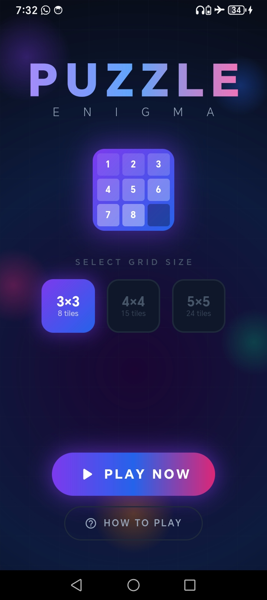
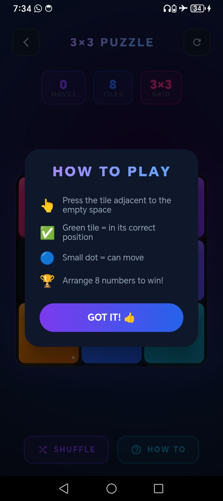
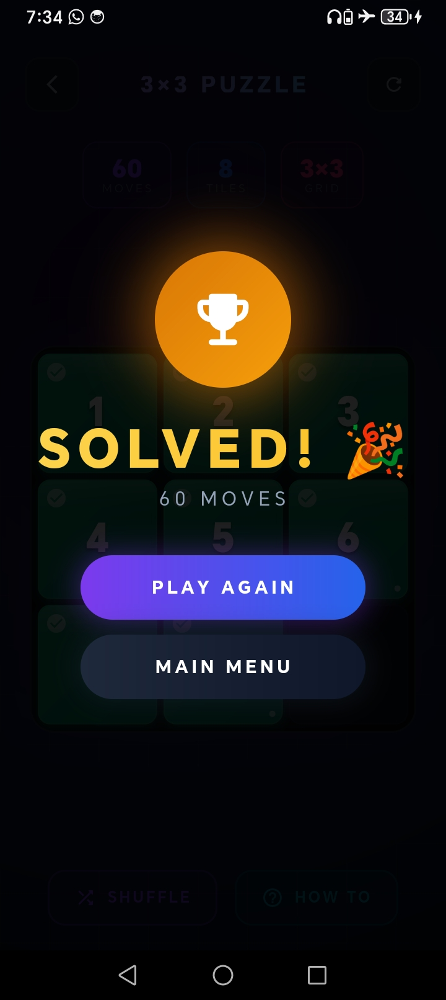
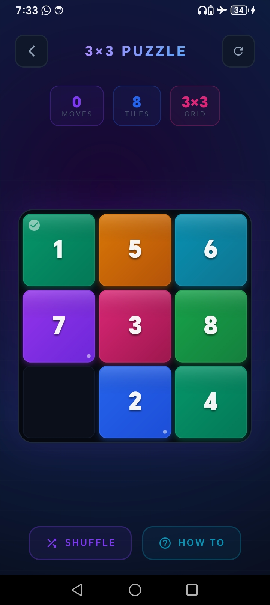
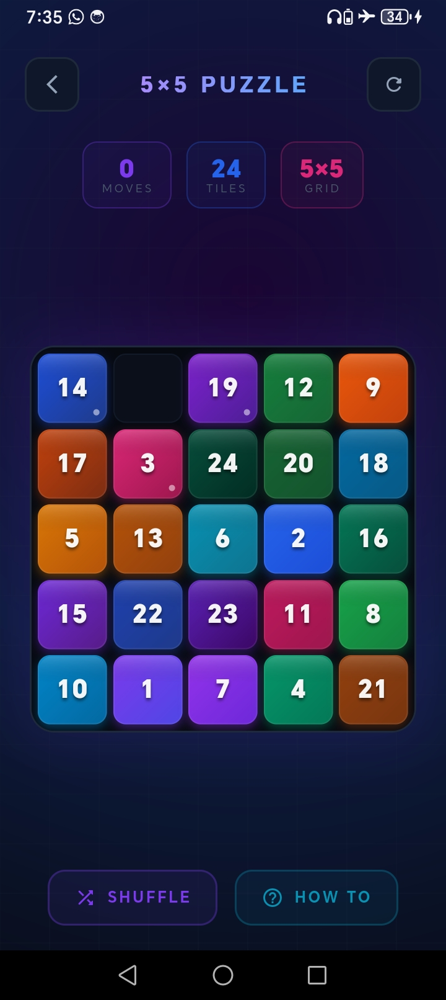
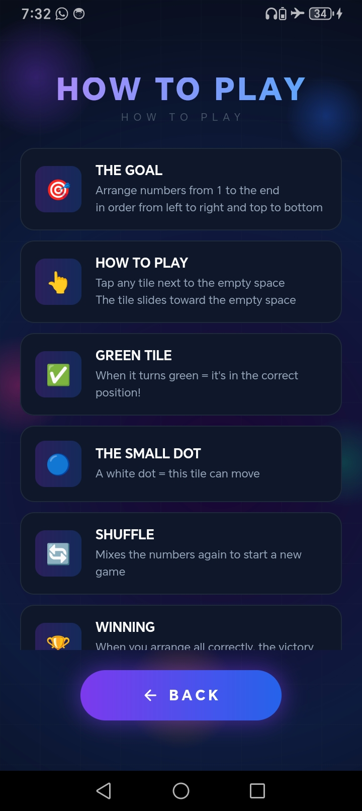

<div align="center">

<!-- Animated Header -->


<!-- Typing Animation -->
<a href="https://git.io/typing-svg">
  
</a>

<br/>

<!-- Badges -->


</div>

---

## 🌌 Enter Another Dimension

> *"This isn't just a game... it's a sensory and mental odyssey that pulls you into a digital cosmos where colors glow, numbers dance, and victory feels like a supernova."*

<div align="center">

### 📸 Screenshots

| Home Screen | Gameplay | Victory |
|:-----------:|:--------:|:-------:|
|  |  |  |

| 3×3 Grid | 5×5 Grid | How to Play |
|:--------:|:--------:|:-----------:|
|  |  |  |

</div>

---

## ✨ Features

```
╔══════════════════════════════════════════════════════════╗
║  🎮  THREE REALMS OF CHALLENGE                          ║
║      3×3 Fast & Fierce  │  4×4 Strategic  │  5×5 WAR   ║
╠══════════════════════════════════════════════════════════╣
║  🌟  BREATHTAKING ANIMATIONS — Smooth as Silk           ║
╠══════════════════════════════════════════════════════════╣
║  🌀  LIVING GALAXY BACKGROUND — Breathes & Glows        ║
╠══════════════════════════════════════════════════════════╣
║  🧠  GENIUS SHUFFLE — 100% Solvable, Always             ║
╠══════════════════════════════════════════════════════════╣
║  ⚡  INSTANT VICTORY DETECTION — No Delay               ║
╠══════════════════════════════════════════════════════════╣
║  💡  SMART MOVE INDICATORS — Secret Language of Tiles   ║
╚══════════════════════════════════════════════════════════╝
```

---

## 🎨 Visual Design Philosophy

<table>
<tr>
<td width="33%" align="center">
<h3>🌑 Dark Mode First</h3>
Sleek dark interface that makes neon colors <strong>explode</strong> with intensity
</td>
<td width="33%" align="center">
<h3>🎨 Alien Gradients</h3>
Every color meticulously chosen to <strong>shock your senses</strong> with unforgettable contrast
</td>
<td width="33%" align="center">
<h3>💚 Living Tiles</h3>
Numbers <strong>light up green</strong> when home, pulse when ready to move
</td>
</tr>
</table>

---

## 🧠 The Logic Behind the Magic

```dart
// The Genius: Every puzzle is solvable — guaranteed.
bool isSolvable(List<int> tiles) {
  int inversions = _countInversions(tiles);
  int gridSize = sqrt(tiles.length).toInt();
  
  if (gridSize.isOdd) return inversions.isEven;
  
  int emptyRow = _getEmptyRowFromBottom(tiles, gridSize);
  return emptyRow.isEven ? inversions.isOdd : inversions.isEven;
}
```

| Feature | Implementation |
|---------|---------------|
| 🖌️ Grid Rendering | `CustomPainter` |
| 💨 Animations | `AnimatedBuilder` |
| ✨ Glow Effects | `ShaderMask` |
| 🧩 Solvability | Inversion Count Algorithm |
| 🏆 Win Detection | Real-time State Check |

---

## 🗺️ How to Play

```
  1️⃣  Choose Your Destiny ──► Select 3×3, 4×4, or 5×5
          │
          ▼
  2️⃣  Unleash the Chaos ───► Press PLAY NOW
          │
          ▼
  3️⃣  Dance with Numbers ──► Tap tiles adjacent to empty space
          │
          ▼
  4️⃣  All tiles turn GREEN = 🎆 YOU CONQUERED THE COSMOS!
```

---

## 📦 Installation

```bash
# 1. Clone the repository
git clone https://github.com/Rozera-xalil/Puzzle_game_FLUTTER.git
cd buzzle

# 2. Install dependencies
flutter pub get

# 3. Launch into the cosmos 🚀
flutter run
```

> **Prerequisite:** Flutter SDK installed on your machine.

---

## 🔮 Roadmap

- [x] 🎮 3×3, 4×4, 5×5 Puzzle Grids
- [x] 🌌 Animated Galaxy Background
- [x] 💚 Smart Victory Detection

---

## 👩‍💻 About the Author

<div align="center">


```
 ██████╗  ██████╗ ███████╗███████╗██████╗  █████╗
 ██╔══██╗██╔═══██╗╚══███╔╝██╔════╝██╔══██╗██╔══██╗
 ██████╔╝██║   ██║  ███╔╝ █████╗  ██████╔╝███████║
 ██╔══██╗██║   ██║ ███╔╝  ██╔══╝  ██╔══██╗██╔══██║
 ██║  ██║╚██████╔╝███████╗███████╗██║  ██║██║  ██║
 ╚═╝  ╚═╝ ╚═════╝ ╚══════╝╚══════╝╚═╝  ╚═╝╚═╝  ╚═╝
```

### **Rozêra Xelîl** ☀️
#### `Full_stack Developer & AI Engineering Student`

🏡 **From:** Rojava &nbsp;&nbsp;|&nbsp;&nbsp;❤️🤍💛💚✌🏻

<br/>


<br/>

> *"2+2=1 ❤️"*
> 

<br/>


</div>

---

<div align="center">


**⭐ Star this repo if it help u! ⭐**

</div>
